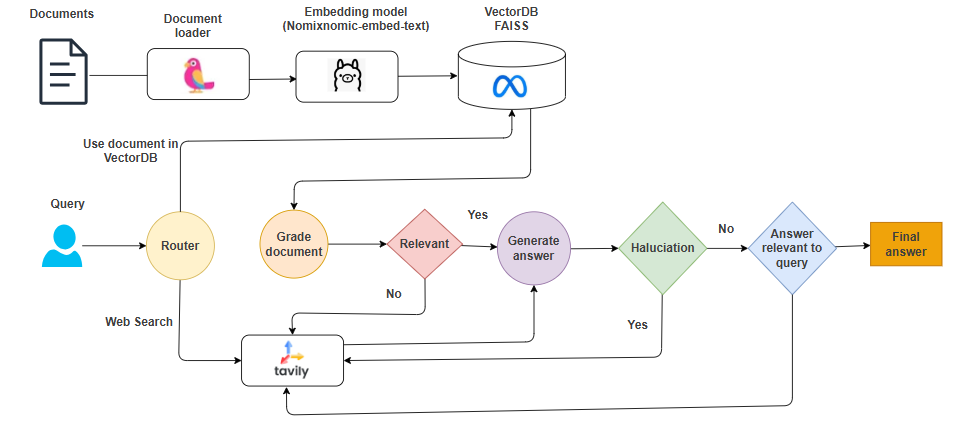

# RAG Agent Code Description

This codebase implements a Reliable Retrieval-Augmented Generation (RAG) Agent using LangGraph, Qwen32B, and FAISS vectorstore. The agent combines concepts from Adaptive RAG, Corrective RAG, and Self-RAG to create a robust question-answering system that routes queries to either a vectorstore or web search, grades retrieved documents for relevance, checks for hallucinations, and ensures useful responses.

# Workflow Overview

The RAG agent operates as follows:

RAG Workflow

**Routing**: The router decides whether to use the vectorstore (for LLM-related questions) or web search (for other topics).

**Retrieval**: If routed to the vectorstore, retrieves the top 2 relevant documents.

**Document Grading**: Grades documents for relevance; if any are irrelevant, triggers a web search.

**Web Search**: Uses Tavily Search API to fetch web results if needed.

**Generation**: Generates an answer using the LLM and retrieved context.

**Validation**: Checks for hallucinations (ensuring the answer is grounded) and usefulness (ensuring it addresses the question). If either check fails, it retries or falls back to web search.

Output: Returns the final answer if validated as grounded and useful.

# Key Features

**Reliability**: LangGraph’s control flow ensures predictable execution, unlike less reliable ReAct agents.

**Adaptability**: Combines vectorstore retrieval with web search fallback for broader question coverage.

**Hallucination Prevention**: Uses graders to ensure answers are factual and relevant.

**Modularity**: The codebase is structured for easy maintenance and extension.

# Usage

To run the agent:

Set up environment variables for GROQ_API_KEY and TAVILY_API_KEY.

- Install dependencies: pip install -r requirements.txt.

- Run the main script: python main.py.

Optionally, visualize the graph using Graphviz and pygraphviz (requires system dependencies).

This implementation provides a robust, scalable framework for building RAG agents, suitable for both beginners and advanced users working on LLM-powered applications.
